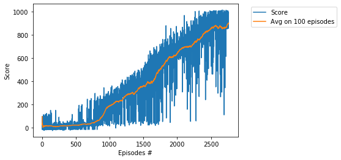

# Project - CarRacing with PPO, Learning from Raw Pixels 

### Introduction

This is the continuous control task learning from pixels, a top-down racing environment. 
State consists of 96x96 pixels. Reward is -0.1 every frame and +1000/N for every track tile visited, 
where N is the total number of tiles in track. For example, if you have finished in 732 frames, 
your reward is 1000 - 0.1\*732 = 926.8 points. The indicators shown at the bottom of the window. 
CarRacing-v0 defines "solving" as getting average reward of 900 over 100 consecutive trials.

### Environment
The environment is simulated by OpenAI package __gym__ as follows:

      env = gym.make('CarRacing-v0', verbose=0)
      
### Hyperparameters

Agent uses the following hyperparameters:

**GAMMA=0.99** # discount, the coefficient related to the **next state**  

**EPOCH= 8** # the parameter in the update mexanism of the PPO  (beter than 10)

**MAX_SIZE = 2000** # the maximal size of the buffer used in the update mechanism

**BATCH=128**  # optimizer and backward mechisms work after sampling BATCH elements

**LEARNING_RATE = 0.001**

**EPS=0.1** # the clipping parameter using for calculation of the **action loss** in the update mechanism 

     surr1 = ratio * advantage
     surr2 = torch.clamp(ratio, 1.0 - EPS, 1.0 + EPS) * advantage
     action_loss = -torch.min(surr1, surr2)

### Neural Network

We use the CNN model with 6 levels Conv2d (torch.nn.Conv2d) and 6 ectified linear units ReLU (torch.nn.ReLU).
The rewards, target and advatage values are calculated by the model:

     target = r + GAMMA * net(next_state)
     advantage = target - net(state)[[1]  ## 1-st return parameter of the forward function
     
### Beta Distribution

The CNN model is used for calculation of parameters __alpha__ and __beta__ of the Beta distribuion.
The Beta distribution (torch.distributions.beta) is used to fetch the action samples.

     alpha, beta = net(state[index])[0]  ## 0-th return parameter of the forward function
     dist = Beta(alpha, beta)

#### References
Modeling policies as beta distributions was supposed in

"_Improving Stochastic Policy Gradients in Continuous Control with Deep Reinforcement Learning using the Beta Distribution_"
by Po-Wei Chou, Daniel Maturana, Sebastian Scherer, in Proceedings of the 34th International Conference on Machine Learning, PMLR 70:834-843, 2017., http://proceedings.mlr.press/v70/chou17a.html

See also "_Clipped Action Policy Gradient_" by Yasuhiro Fujita, Shin-ichi Maeda, https://arxiv.org/abs/1802.07564

### Training 

We train the agent to understand that it can use information from its surroundings to inform the next best action.
The score **901.81** was achieved on the episide **2760** after trainibg **6 hours 53 minutes**.   

#### Last Episodes
.....     
Ep. 2750, Ep.Timesteps 94, Score: 1006.80, Avg.Score: 893.55, Run.Score 888.10, Time: 06:51:32      
Ep. 2751, Ep.Timesteps 100, Score: 992.34, Avg.Score: 893.43, Run.Score 889.14, Time: 06:51:41     
Ep. 2752, Ep.Timesteps 100, Score: 976.90, Avg.Score: 894.43, Run.Score 890.02, Time: 06:51:51    
Ep. 2753, Ep.Timesteps 100, Score: 871.87, Avg.Score: 894.01, Run.Score 889.84, Time: 06:52:01     
Ep. 2754, Ep.Timesteps 100, Score: 1000.60, Avg.Score: 894.20, Run.Score 890.95, Time: 06:52:10     
Ep. 2755, Ep.Timesteps 100, Score: 992.98, Avg.Score: 895.36, Run.Score 891.97, Time: 06:52:20     
Ep. 2756, Ep.Timesteps 100, Score: 941.98, Avg.Score: 895.57, Run.Score 892.47, Time: 06:52:30     
Ep. 2757, Ep.Timesteps 100, Score: 854.43, Avg.Score: 895.39, Run.Score 892.09, Time: 06:52:40     
Ep. 2758, Ep.Timesteps 100, Score: 989.55, Avg.Score: 895.27, Run.Score 893.06, Time: 06:52:49     
Ep. 2759, Ep.Timesteps 100, Score: 986.25, Avg.Score: 901.81, Run.Score 893.99, Time: 06:52:59    
Solved environment! Running score is 893.99, Avg.Score: 901.81 !    

### Learning from Row Pixels

* Move image to Grayscale   
Let's see that the triple [0.299, 0.587, 0.114] represents the vector 'Dark Green' in the color space.   
First, let's go to integer gray levels: [(int)(0.299\*256), (int)(0.587\*256), (int)(0.114\*256)] = [76, 150, 29].        
Convert this set to hex numbers:   [hex(76), hex(150), hex(29)] = ('0x4c', '0x96', '0x1d')    
In the browser field, we just enter:  color(4d961d), and we get the 'Dark Green'.    

     
     

