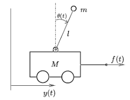

## Hill Climbing with Adaptive Noise Scaling

In this notebook, we train the **Hill Climbing** Agent with     
**Adaptive Noise Scaling** with OpenAI Gym's Cartpole environment.

## Real CartPole system 
Clickable image, get the real CartPole system trained from scratch in just 7 trials (on youtube).   
       

## Policy-based method

Hill Climbing is the **policy-based method** and does not use   
policy-gradient methods such as gradient ascent.    
The environment is solved in just 113 episodes!   

## Class Policy

The only values that class Policy contains are weights.   
We should find such weights which maximize    
the return value (= sum of all rewards with discounts).   

## Finding the action, example

state is 4-dimensional vector

state    
**array([-0.04363321, -0.14877061,  0.01284913,  0.2758415 ])**

self.w.shape    
**(4,2)**

self.w =    
**array([[5.48813504e-05, 7.15189366e-05],
       [6.02763376e-05, 5.44883183e-05],
       [4.23654799e-05, 6.45894113e-05],
       [4.37587211e-05, 8.91773001e-05]])**
       
x = np.dot(state, self.w)   
x    
**array([1.25283361e-06, 1.42018566e-05])**

probs = np.exp(x)/sum(np.exp(x))   
probs   
**array([0.49999676, 0.50000324])**

action = np.argmax(probs   
action   
**1**   

## Adaptive Noise Scaling

Let _R_ be the current accumulated return, and _best_R_ be best return found.
    
If _R >= best_R_ we **gradually reduce** the extra element containing noise:
    
   _noise_scale = max(1e-3, noise_scale / 2)_   
   _policy.w += noise_scale * np.random.rand(*policy.w.shape)_    
    
otherwise we **gradually increase** the additional element that contains noise 

   _noise_scale = min(2, noise_scale * 2)_   
   _policy.w = best_w + noise_scale * np.random.rand(*policy.w.shape)_    
         

