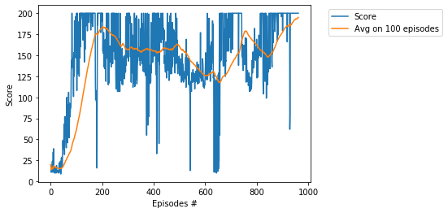
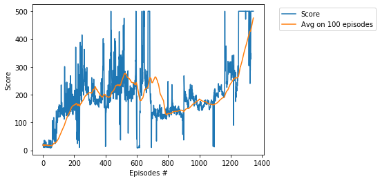

# Project -  Cartpole with Deep Q-Learning,  Pytorch

### Environment

Solving the environment require an average total reward of over **195** for _Cartpole-v0_  and **475** for _Cartpole-v1_    
over 100 consecutive episodes. A pole is attached by an joint to a cart, which moves along a track. The system is controlled by applying a force of +1 or -1 to the cart. The pendulum starts upright, and the goal is to prevent it from falling over. A reward of +1 is provided for every timestep that the pole remains upright. The episode ends when the pole > 15 degrees from vertical, or the cart moves > 2.4 units from the center.

For another solution, see 
* [CartPole-Policy-Based-Hill-Climbing](https://github.com/Rafael1s/Deep-Reinforcement-Learning-Udacity/tree/master/CartPole-Policy-Based-Hill-Climbing), or 
* [CartPole-Policy-Gradient-Reinforce](https://github.com/Rafael1s/Deep-Reinforcement-Learning-Udacity/tree/master/CartPole-Policy-Gradient-Reinforce), or
* [Cartpole with Doouble Deep Q-Learning](https://github.com/Rafael1s/Deep-Reinforcement-Learning-Udacity/tree/master/Cartpole-Double-Deep-Q-Learning)      

### Deep Q-Learning   

For another Deep Q-Learning project, see [Navigation](https://github.com/Rafael1s/Deep-Reinforcement-Learning-Udacity/tree/master/Project-1_Navigation-DQN).    
In the project _Navigation_,  4 discrete actions are available:  0 - move forward, 1 - move backward, 2 - turn left, 3 - turn right.    
In the project _Cartpole_, 2 discrete actions are available:  0 - push cart to the left, 1 - push cart to the right.    

### Agent   

The class **Agent** is defined in _agent.py_. This is the well-known class implementing 
the following mechanisms:

* Two Q-Networks (local and target) using the simple neural network.
* Replay memory (using the class ReplayBuffer)
* Epsilon-greedy mechanism
* Q-learning, i.e., using the max value for all possible actions
* Computing the loss function by MSE loss
* Minimize the loss by gradient descend mechanism using the ADAM optimizer

### Neural Networks

The Deep Q-Learning agent uses 3 following _neural networks_ (see method _learn()_):

### Training History

1.  For Cartpole-v0: Score **195** achieved in **962** episodes   

2.  For Cartpole-v1: Score **475** achived in **1345** episodes   
     

## Watch the Trained Agent   
For both neural networks, _q_local_ and _q_traget_, we save the trained weights into checkpoint files    
with the extension _pth_. The corresponding files are saved into the directory _dir_chk_V0_  for _Cartpole-v0_    
and the directory _dir_chk_V1_ for _Cartpole-v1_.
Using notebook **WatchAgent-DQN.ipynb we** can load    
the trained weights and replay them.

### Credit
The following github projects helpfed me in this project:  [pytorch/tutorials](https://github.com/pytorch/tutorials/blob/master/intermediate_source/reinforcement_q_learning.py)  and  [Pocuston/Cartpole-v0](https://gist.github.com/Pocuston/13f1a7786648e1e2ff95bfad02a51521).  

