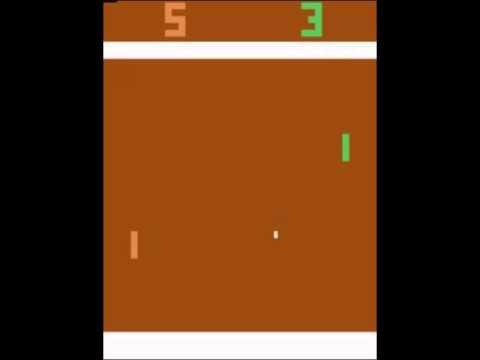

# Project:  Pong - REINFORCE

## Introduction

In this notebook, we implement an agent learning to play **Pong**.
The training uses policy gradients. We train on a GPU.
The  model described in [Deep Reinforcement Learning: 
Pong from Pixels](http://karpathy.github.io/2016/05/31/rl/), 
which contains an introduction and background to this model.

## Algorithm REINFORCE

Algorithm REINFORCE can be breifly described  as the loop of 3 components:

### Line 1.

Here, **\tau^i** are the trajectories of steps **(a_t,s_t)** , and **\pi_\theta(a_t, s_t)**
are probabilities (depending on the weights \theta) of the
action **a^i_t** if the last state was **s^i_t**.  In this component, 
the algorithm collects the data, see the function

     def collect_trajectories(envs, policy, tmax=200, nrand=5)

in pong_util.py.  Here, tmax  is the length of the trajectory (parameter also
known as __horizon__) The function __collect_\__trajectories__ performs
5 (nrand) random steps (in the RIGHT or LEFT) and get 2 consecutive frames
__fr1__ and __fr2__.  The function _preprocess_\__batch_  
crops image and downsample to 80x80 stack two frames together as input.
The probabilies __probs__ returned from the finction __policy__ are given only 
for the action LEFT, the probability for the RIGHT are calculated as
1 - __probs__.  

### Line 2.

Here, __J(\theta)__ is the calculated expected return,
see the function

     def surrogate(policy, old_probs, states, actions, rewards, \
              discount = 0.995, beta=0.01)

The value __J(\theta)__ is the discounted sum. Further, we calculate
log-probabilities.

### Line 3.
Here, we use the the gradient ascent mechanism,
which is realised in pong-REINFORCE notebook, in the traing lines

    L = -pong_utils.surrogate(model, old_probs, states, actions, rewards, beta=beta)
    optimizer.zero_grad()
    L.backward()
    optimizer.step()

Here, L means the loss function (depending on \theta).

