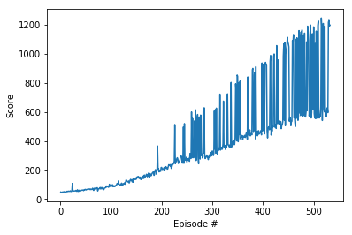

## Project 2: Continuous Control (Crawler)   

### Introduction

For this project, we work with the [Crawler](https://github.com/Unity-Technologies/ml-agents/blob/master/docs/Learning-Environment-Examples.md#crawler) environment. A creature with 4 arms and 4 forearms.   
Agent Reward Function (independent):
* +0.03 times body velocity in the goal direction.
* +0.01 times body direction alignment with goal direction.

Observation space size (per agent): 129   
Action space size (per agent): 20

### Prepare environment on the local machine

You need at least the following three packages:

1. **deep-reinforcement-learning  (DRLND)**        
   The instructions to set up the DRLND repository can be found [here](https://github.com/udacity/deep-reinforcement-learning#dependencies). This repository contains material related to Udacity's [Deep Reinforcement Learning Nanodegree](https://www.udacity.com/course/deep-reinforcement-learning-nanodegree--nd893) program.

2. **ml-agents  (ML-Agents Toolkit)**
   To configure the ML-Agents Toolkit for Windows you need to complete the following steps:
    
    2.1  Creating a new Conda environment:
    
       conda create -n ml-agents python=3.6
       
    2.2 Activating ml-agents by the following command:
    
       activate ml-agents
       
    2.3 Latest versions of TensorFlow won't work, so you will need to make sure that you install version 1.7.1:
    
       pip install tensorflow==1.7.1
       
    For details on installing the ML-Agents Toolkit, see the instructions [here](https://github.com/Unity-Technologies/ml-agents/blob/master/docs/Installation-Windows.md).     
    
3. **Unity environment _Crawler_**

    For this project, we not need to install Unity because the environment already built. For 20 agents, the environment     
    can be downloaded as follows:

   Windows (64-bit), [click here](https://s3-us-west-1.amazonaws.com/udacity-drlnd/P2/Crawler/Crawler_Windows_x86_64.zip)    
   Windows (32-bit), [click here](https://s3-us-west-1.amazonaws.com/udacity-drlnd/P2/Crawler/Crawler_Windows_x86.zip)     

   Download this environment zip into  **p2_continuous-control/** folder, and unzip the file.
   
### Update mechanism

Standard policy gradient methods perform one gradient update per data sample.     
In the [original paper](https://arxiv.org/abs/1707.06347) it was proposed a novel objective function that enables **multiple epochs**.   
This is  the **loss** function _L\_t(\\theta)_, which is (approximately) maximized each iteration:    

Parameters **c1**, **c2** and **epoch** are essential hyperparameters in the PPO algorithm.
In this agent, c1 = -0.5,   c2 = 0.01. 

                policy_loss = -torch.min(obj, obj_clipped) - 0.01 * entropy_loss
                value_loss = 0.5 * (sampled_returns - values).pow(2)
                loss = policy_loss + value_loss 

The update is performed in the function **agent.step()**.

### Train the Agent

   The environment was solved   
 * in **676 episodes** with **score 500**, see _Crawler_PPO_676epis_500score.ipynb_   
 
 * in **550 episodes** with **score 650**, see _Crawler_PPO_550epis_650score.ipynb_
 
 * in **532 episodes** with **score 800**, see _Crawler_PPO_532epis_800score.ipynb_
 
 * in **678 episodes** with **score 1200**, see _Crawler_PPO_678epis_1200score.ipynb_

### Training History

 * 1. Input: fc1_units = 1024, fc2_units = 1024, Max Step of Episode = 1000   
   Result: 676 episodes, score = 500    
       
   
 * 2. Input: fc1_units = 1024, fc2_units = 1024, Max Step of Episode = 1500    
   Result: 550 episodes, score = 650       
      
     
 * 3. Input: fc1_units = 128, fc2_units = 128, Max Step of Episode = 2000   
   Result: 532 episodes, score = 800     
      
      
 * 4. InputL fc1_units = 128, fc2_units = 128, Max Step of Episode = 2000       
    Result: 678 episodes, score = 1200   
      
   
### Watch the Trained Agent

For both neural networks, the actor and the critic, we save the trained weights into checkpoint files   
with the extension pth.  For all cases, the corresponding files are saved into the directory checkpoints.    
Using notebook _WatchAgent.ipynb_ we can load the trained weights and replay them.

### Other PPO projects  
  * [Pong](../Pong-Policy-Gradient-PPO), 8 parallel agents
  * [CarRacing](../CarRacing-From-Pixels-PPO),  Single agent, Learning from pixels
  * [BipedalWalker](../BipedalWalker-PPO-VectorizedEnv),   16 parallel agents

### Credit   

Most of the code is based on the Udacity code for PPO.
   
